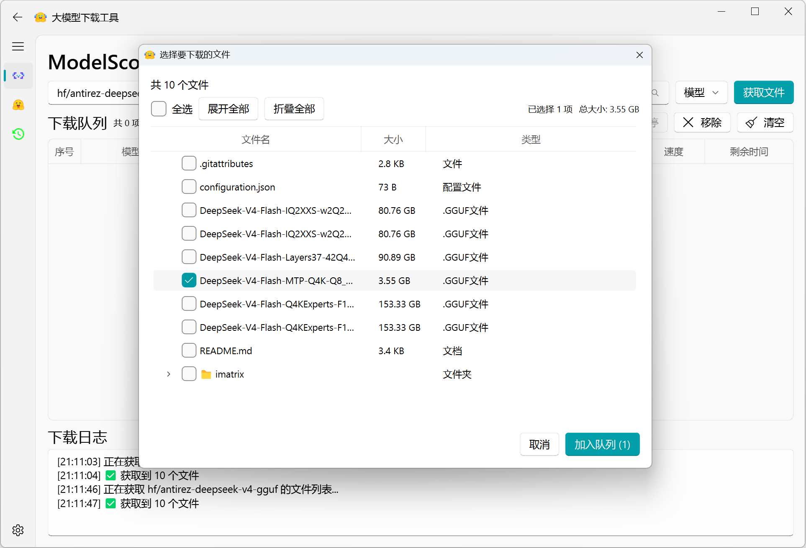
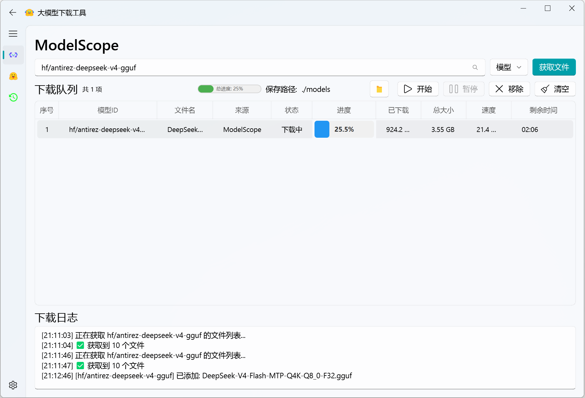
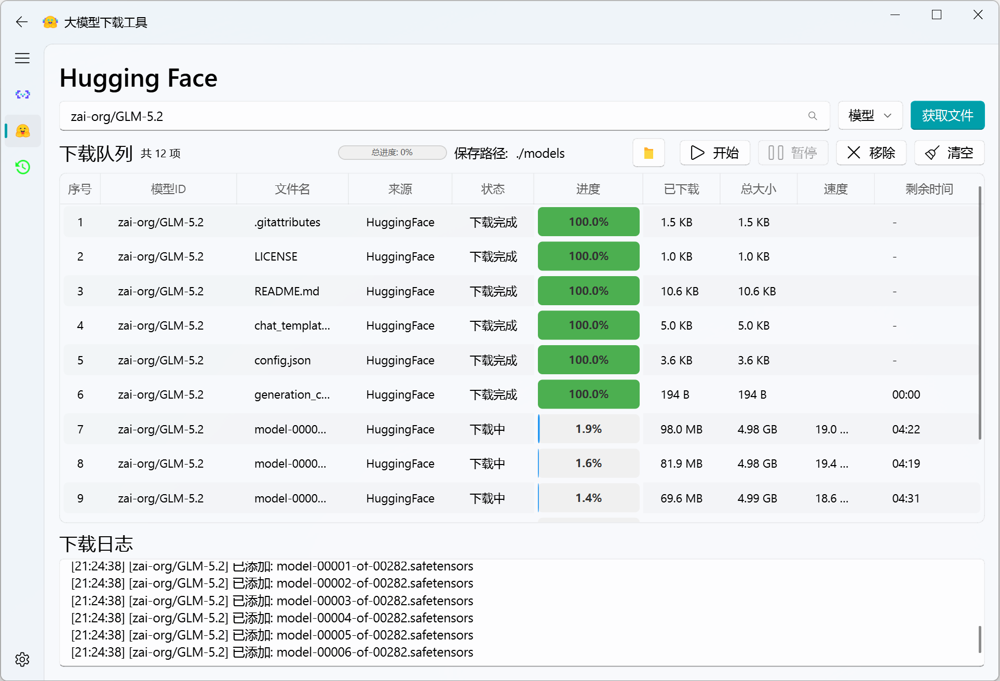
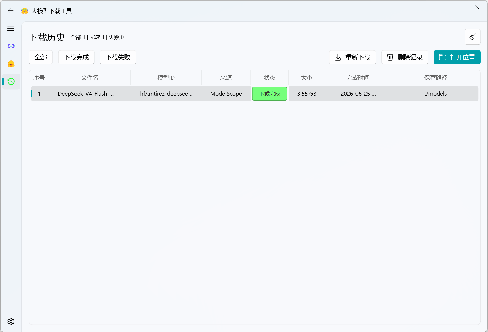
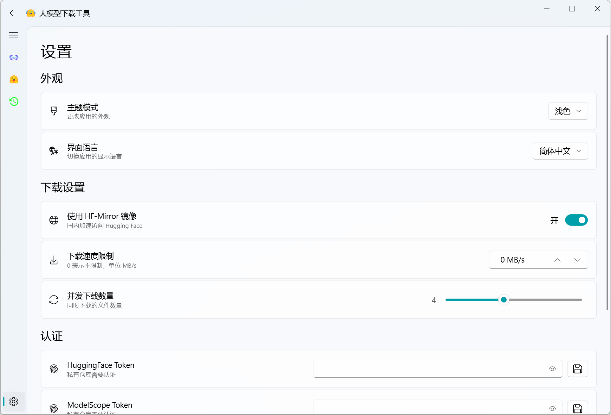

# ModelDownloader — AI Model Download Tool

<p align="center">

<p align="center">

A desktop AI model download tool built with PySide6 + QFluentWidgets, supporting model and dataset downloads from Hugging Face and ModelScope.


## Features

- **Multi-source Support** — Download models and datasets from both Hugging Face and ModelScope
- **Tree File Selection** — Browse repository files in directory structure with multi-select support
- **Download Queue Management** — Queue multiple download tasks with pause/resume/cancel support, up to 3 concurrent downloads
- **Download History** — Persistent history records with status filtering, re-download, and open file location
- **Theme Switching** — Built-in light/dark/system themes
- **Bilingual Support** — Switch between Chinese and English interface without restart
- **Authentication** — HuggingFace / ModelScope Token authentication for private and gated repositories
- **HF-Mirror** — One-click enable domestic mirror for accelerated Hugging Face access
- **One-click Build** — `build.py` auto-detects platform and packages as standalone APP

## Screenshots

### File Selection Dialog

Browse repository files in tree structure, with multi-select and select-all support:

<p align="center">
  
</p>

### Main Pages

The application includes four main pages:

#### ModelScope Page

Enter repository ID, get file list, and select files to download:

<p align="center">
  
</p>

#### Hugging Face Page

Support HF-Mirror for accelerated downloads:

<p align="center">
  
</p>

#### Download History Page

View history records, filter by status, and re-download:

<p align="center">
  
</p>

#### Settings Page

Theme, language, mirror toggle, Token authentication, and about info:

<p align="center">
  
</p>

## Installation & Run

### Requirements

- Python 3.10+
- PySide6 6.7+
- QFluentWidgets 1.11+

### Install Dependencies

```bash
pip install -r requirements.txt
```

### Run

```bash
python main.py
```

### Build as Standalone APP

```bash
python build.py                     # Auto-detect platform and build
python build.py --onefile            # Build as single exe file
python build.py --platform windows   # Specify target platform
python build.py --no-clean           # Skip cleaning old builds
```

Build output is located in `~/builds/` directory.

## Project Structure

```
model-downloader/
├── main.py                  # Application entry
├── build.py                 # One-click build script
├── requirements.txt         # Dependencies list
├── ModelDownloader.spec     # PyInstaller config
├── todolist.md              # TODO list
└── src/
    ├── __init__.py          # Package exports
    ├── main_window.py       # Main window + repo pages + settings
    ├── downloader.py        # Download engine (FileInfo / DownloadTask / RepoProvider)
    ├── download_queue.py    # Download queue widget (table + progress bar)
    ├── download_log.py      # Download log widget
    ├── download_history.py  # Download history manager
    ├── file_select_dialog.py# Tree file selection dialog
    ├── config.py            # App config (theme/language/token/mirror)
    ├── i18n.py              # Bilingual translation manager
    └── icon/                # Icon resources
        ├── icon.ico         # App icon
        ├── huggingface.svg  # HuggingFace navigation icon
        ├── modelscope.svg   # ModelScope navigation icon
        └── history.svg      # Download history navigation icon
```

## Token Authentication

To access private repositories or gated repos, configure your Token:

1. Open Settings page → Authentication card
2. Enter HuggingFace / ModelScope Access Token
3. Click the link icon to go directly to the Token generation page
4. Token is only stored locally in config file and used for API authentication

## License

MIT License
